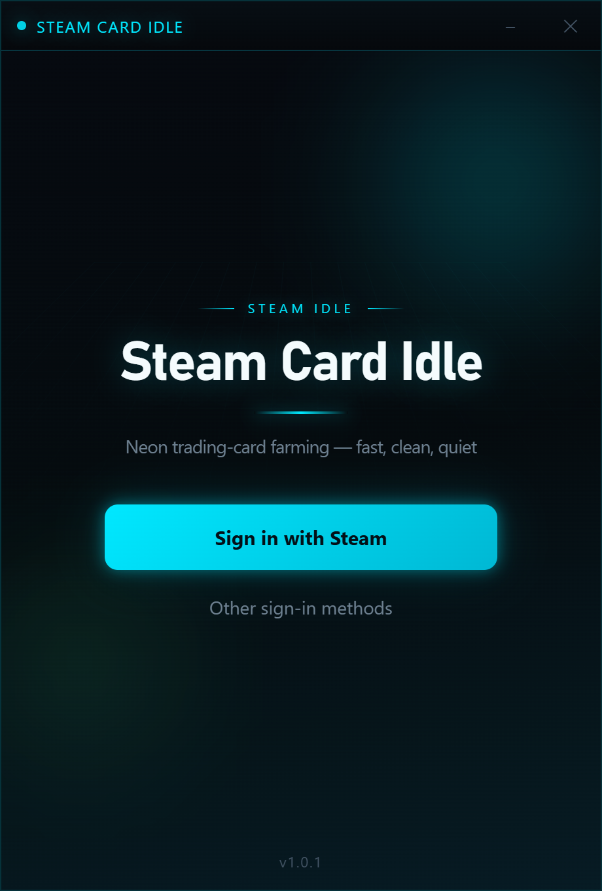
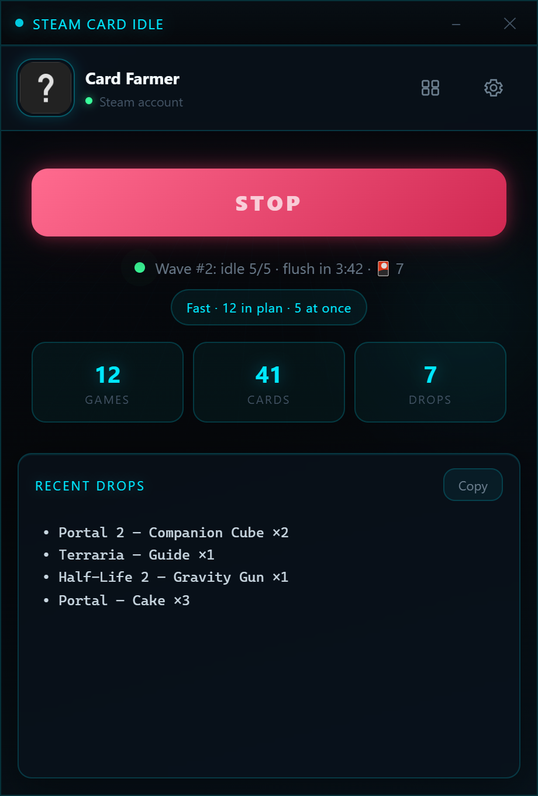
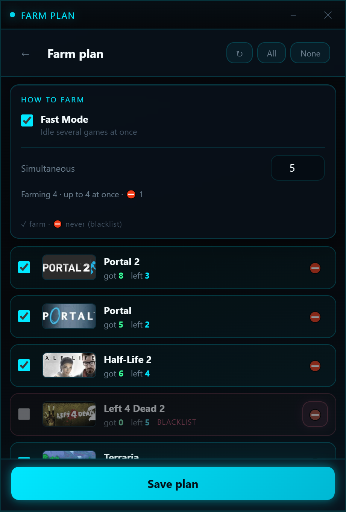

  

# Steam Card Idle

Фарм Steam Trading Cards на Windows — скачал, запустил, собрал карты.  
Farm Steam Trading Cards on Windows — download, run, collect cards.

  
  
  

---

## Русский

### Скачать

1. Зайди в **[Releases](../../releases)**
2. Скачай **SteamCardIdle-windows-x64.zip** (актуальный — **v1.0.2**)
3. Распакуй куда угодно
4. Запусти **SteamCardIdle.exe** (Steam уже должен быть открыт и ты в аккаунте)

Дальше в приложении: войти через Steam → план фарма → **START**.

Python, pip и прочий ад ставить **не нужно**.

### Что умеет

- Удобное окно: вход, план, дропы, настройки
- **Fast Mode** — несколько игр в idle сразу
- **Solo** — одна игра, с тем же циклом flush
- Свой список игр, blacklist и лимит
- Автоматический **flush** (по умолчанию каждые **5 минут**) — Steam нормально зачисляет карты
- Вход в один клик через Steam

### Почему это безопасно

- **Нет облака и чужих серверов.** Всё крутится только на твоём ПК. Логин и cookies никуда не отправляются «нам» — нас как сервиса нет.
- **Пароль Steam мы не храним.** Вход идёт через обычное окно браузера (Edge/Chrome), как на самом Steam. В приложении остаются только локальные session cookies, чтобы читать бейджи и инвентарь.
- **Открытый исходный код.** Можно самому посмотреть, что делает программа, или собрать exe из исходников.
- **Steam остаётся Steam.** Мы не подменяем клиент и не просим «ввести логин на левом сайте» — нужен уже запущенный официальный Steam.
- **[VirusTotal](https://www.virustotal.com/gui/url/ffb23246bea8d4564293daf87b22061dc22cbb459b57f419183b2c27dc5477a0)** — проверка download URL релиза v1.0.2.
- **SHA256** (`SteamCardIdle-windows-x64.zip` v1.0.2): `9258171D1CCFC1E6520995A0CBCE629EE1AD32ED7B0794853DFB8D3D451F1CA8`

> Используй на свой страх и риск: idle farming может противоречить правилам Steam. К аккаунту относись бережно (не шарь `config.json` с cookies).

---

## English

### Download

1. Open **[Releases](../../releases)**
2. Download **SteamCardIdle-windows-x64.zip** (current — **v1.0.2**)
3. Unpack anywhere
4. Run **SteamCardIdle.exe** (Steam should already be open and you’re signed in)

Then in the app: sign in with Steam → farm plan → **START**.

No Python, pip, or other setup required.

### Features

- Simple UI: login, plan, drops, settings
- **Fast Mode** — idle multiple games at once
- **Solo** — one game at a time, same flush cycle
- Custom game list, blacklist, and concurrency limit
- Automatic **flush** (default every **5 minutes**) so Steam credits drops properly
- One-click Steam login

### Why it’s safe

- **No cloud, no third-party servers.** Everything runs on your PC only. Login and cookies are never sent “to us” — there is no service on our side.
- **We don’t store your Steam password.** Sign-in uses a normal browser window (Edge/Chrome), just like Steam itself. The app only keeps local session cookies to read badges and inventory.
- **Open source.** You can check what the program does, or build the exe from source yourself.
- **Steam stays Steam.** We don’t replace the client or ask you to log in on a shady site — you need the official Steam client already running.
- **[VirusTotal](https://www.virustotal.com/gui/url/ffb23246bea8d4564293daf87b22061dc22cbb459b57f419183b2c27dc5477a0)** — scan of the v1.0.2 release zip download URL.
- **SHA256** (`SteamCardIdle-windows-x64.zip` v1.0.2): `9258171D1CCFC1E6520995A0CBCE629EE1AD32ED7B0794853DFB8D3D451F1CA8`

> Use at your own risk: idle farming may conflict with Steam’s rules. Treat your account carefully (don’t share `config.json` with cookies).

---

## License

MIT — see [LICENSE](LICENSE).  
Not affiliated with Valve Corporation.
